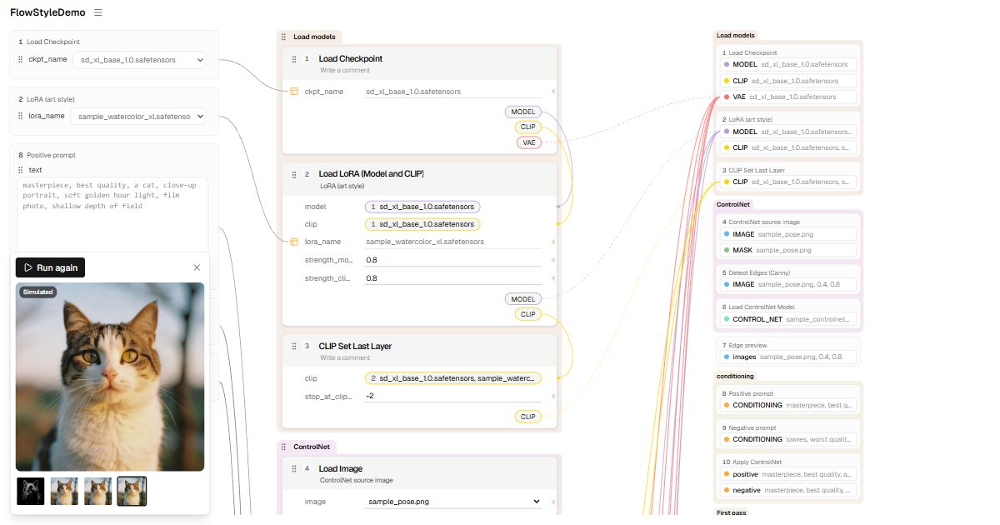


# FlowStyleDemo

A middle ground between the node graph and App Mode: the same ComfyUI workflow, laid out as a
single top-to-bottom column of cards in processing order, with the inputs you change on the
left and the data sources on the right. Nothing hidden.

**Try it:** https://usegird.github.io/flowui-demo/

## What this is

- A static, compiled demo page. Everything runs in your browser.
- It does **not** connect to ComfyUI and sends nothing anywhere.
- **Run (simulated)** only replays progress and shows sample images. They are not generated
  from the workflow on screen.
- You can open your own workflow (`.json`, or a `.png` with an embedded workflow). Nodes the demo
  has no definition for are marked as missing.

## Sample workflow

The workflow shown when the page opens is [sample-workflow.json](sample-workflow.json): a
standard-node, A1111-style pipeline (LoRA -> ControlNet -> hires fix -> upscale). It is a plain
ComfyUI workflow file, so you can open the same file in ComfyUI and compare.

This is that file opened in ComfyUI after the demo laid it out. The red boxes mark the nodes
whose inputs appear in the App column on the left. Long links that would run through other
nodes are routed below the rows with ComfyUI's own reroutes, so the file stays plain ComfyUI.

## About the source code

This demo is a mock-up built only to test whether the idea is practical, so the source code
is not published. This repository holds only the build output.

## Third-party notices

Licenses of the third-party packages included in the build are listed in
[THIRD-PARTY-NOTICES.txt](THIRD-PARTY-NOTICES.txt).
